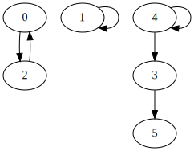

# Explanation

I posted this in Discord. It is not polished enough to be a blog post but it might suffice until I get around to writing the full thing.

Consider the following stack effect:

```
0 1 2 3 4 5 -- 0 1 2 3 4 5
a b c d e f -- c b a e e d
```

Create a directed graph with 6 vertices `(0, 1, 2, 3, 4, 5)` and edges `(0 -> 2), (1 -> 1), (2 -> 0), (3 -> 5), (4 -> 3), (4 -> 4)`. 



Each vertex represents a cell and the edge represents how data wants to be moved between cells.

Notice all vertexes have indegree 0 or 1.

Now it's probably a good idea to prove that all weakly connected components have at most 1 cycle (each cell can only hold 1 byte). Then you should prove that if we break a cycle by removing 1 edge then one of vertexes within the cycle would become the top of its component's topological sort (the cycle can not be a child of another node).

It's trivial to understand that we can handle all weakly connected components separately. They can be applied in any order so long as there are no conflicts with the temperorary cell(s).

A topological sort could tell us useful information about the order operations must be made. For example if we ignore the `(4->4)` edge and focus on the `[3, 4, 5]` component we would have topological sort `[4, 3, 5]`. This means we must move 5 then we can move 3 then we can move 4.

The problem is we cannot topologically sort a graph with a cycle. I was going to come up with some complicated cutting algorithm where you cut out the cycle and then continue the topological sort but I found something much better. <https://en.wikipedia.org/wiki/Tarjan%27s_strongly_connected_components_algorithm>

Donald Knuth wrote about Tarjan's algorithm:
> The data structures that he devised for this problem fit together in an amazingly beautiful way, so that the quantities you need to look at while exploring a directed graph are always magically at your fingertips. And his algorithm also does topological sorting as a byproduct.

The result of tarjan scc on the graph is: `[ [0, 2], [1], [4], [3], [5] ]`. The out edges of each node derives the MOVs and the ordering derives in the ordering. There is just some extra logic to detect order 1 cycles and to clear nodes with outdegree 0 (like node 5)

So the final result is:
```
[0, 2] | (0 -> 2 , 2 -> 0)
MOV 0 -> T
MOV 2 -> {0}
MOV T -> {2}
[1] | (1 -> 1)
// order 1 loops are ignored
[4] | (4 -> 3, 4 -> 4)
MOV 4 -> T
MOV T -> {3, 4}
[3] | (3 -> 5)
MOV 3 -> {5}
[5] | (5 -> 5)
// order 1 loops are ignored
```

