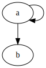
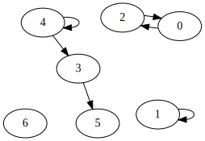

# Explanation

I have been working on a stack based programming language to compile to brainfuck named [serotonin](https://github.com/Alextopher/serotonin). Stack based languages commonly have operations to permute or duplicate elements on the stack.

## Stack effect diagrams

For example, the `SWAP` function: takes the top 2 elements of the stack and switches their order.

```text
        SWAP
Before:      After:
 _____        _____
|     |      |     |
|  b  |      |  a  |
|_____|      |_____|
|     |      |     |
|  a  |      |  b  |
|_____|      |_____|
```

Or there is the `DUP` function that pops the top element off the stack and pushes 2 copies.

```text
        DUP
Before:      After:
             _____ 
            |     |
            |  a  |
 _____      |_____|
|     |     |     |
|  a  |     |  a  |
|_____|     |_____|
```

Those ASCII diagrams describing stack effects are nice, but unwieldy. The first step to using a stacked based programming language is to learn to read stack effect diagrams.

Stack effect diagrams are very straightforward, you write the stack before the operation followed by the stack after[^]. Stacks effects are written bottom to top. For example, `DUP` can be written `(a -- a a)` and `SWAP` `(a b -- b a)`.

The goal of `autoperm` is to translate a stack effect diagram into a brainfuck program that preforms that operation on the tape.More generally `autoperm` might also find usage in another project by providing performant algorithms in languages like Joy or FORTH.

## An algorithm for permutations

At the beginning of this project I wasn't confident what the algorithm would look like. Rather than solving the entire problem at once I noticed is that there is a category of stack effects that are _permutations_. That is, the only the order of the elements on the stack is changed and no elements are added or removed. `SWAP` is one such permutation, while `DUP` is not. Permutations are fairly well understood concepts in group theory.

I noticed that a stack effect diagram of a permutation is actually it's [Two-line notation](https://en.wikipedia.org/wiki/Permutation#Two-line_notation)

```math
SWAP = \begin{pmatrix}
  a & b \\
  b & a
\end{pmatrix}
```

Two-line notation isn't the only choice of notation, [Cycle notation](https://en.wikipedia.org/wiki/Permutation#Cycle_notation) is another common choice. In cycle notation, a permutation is expressed as a product of cycles. A cycle is a sequence of elements that are permuted cyclically, meaning that the first element is moved to the second position, the second to the third position, and so on, until the last element is moved to the first position.

In our example, the permutation `SWAP` is expressed as $(a b)$ in cycle notation. A larger example, `SWAP2 (a b c d -- c d a b)` is $(a c)(b d)$.

Cycles have 2 very useful properties. Every cycle is disjoint (no element appears in more than one cycle) and the product of cycles are commutative (cycles can be applied in any order). Together, using those two properties we can reduce the problem of "permutate this stack" to "execute these cycles individually". The latter is much easier, In fact I already outline the algorithm earlier.

> first element is moved to the second position, the second to the third position, and so on, until the last element is moved to the first position.

Well, actually, we can only move the first element to the second position when the second position is already empty, or we'll clobber the memory. So what we'll do instead is reverse the process, move the last element to a temporary cell (`T`), then move the second to last element to the last position, and so on, until we've moved the first element, where we finish the routine by moving the temporary cell to the first position.

Writing this is a simple assembly language:

```text
SWAP (a b -- b a) -> (a b)

MOV b T
MOV a b
MOV T a
```

Or using stack indices / cells instead of letters:

```text
SWAP (0 1 -- 1 0) -> (0 1)

MOV 1 2 // 2 is an unused cell
MOV 0 1
MOV 2 0
```

In brainfuck the `MOV` instruction is very simple. Assume the current cell pointer is 0, then `MOV 0 X` is `[>x+<x-]`, Or shift left X times, increment, shift right X times, decrement. `MOV A B` is similar, we can rewrite it as `SHIFT A` (move right A), `MOV 0 B-A`, `SHIFT -A` (reverse the first step). Generally book keeping the cell pointer is a bit tedious, but not too difficult. `MOV` extends well to writing to a set of cells for example `MOV 0 {1 2 3} : [>+>+>+<<<-]`. This extended `MOV` will be useful later.

Finally we have an outline for the permutation algorithm is:

- Translate stack element names into numeric indexes (a b -- b a ==> 0 1 -- 1 0).
- Translate the stack effect into Two-line notation (`Map<usize, usize>`)
- Covert two-line notation into cycle notation (`Vec<Vec<usize>>`)
- Generate "MOV" instructions
- Convert to brainfuck

## A stronger algorithm

Unfortunately, most functions are not simple permutations. I struggled for a long time to tweak the permutation algorithm to work on any function. In a permutation repeated elements are not allowed (`(0 0)` is not a valid cycle), so there is no obvious way to represent something like `DUP: 0 -- 0 0`. One train of thought brought me to thinking of grouping indices into sets, so such that the set of "sets of indices" are disjoint. In the `DUP` case that could have looked like `({0} {0 1})`, which could generate something like `MOV 0 T; MOV T {0 1}` (which is valid BF, more on that later).

This works for a few new functions but doesn't move the needle very far. We can now write `TUCK: (a b -- b a b)`

```text
TUCK: (a b -- b a b) => (0 1 2 T -- 1 0 1 T)
MOV 0 T
MOV 1 {0 2}
MOV T 1
```

But this won't work for more exotic functions. The trouble is if we need more sets in our cycles, how do we handle `({0 1} {2 3})`, what does that even mean, I'm not sure. Instead of trying to force through this problem I started thinking about different ways to represent the problem. That's when I considered the idea of using a directed graph. Graphs are very powerful tools for representing relationships, and they come with existing algorithms for solving a plethora of problems.

We draw edges representing the movement of data between indices. For example:

```text
DUP
Vertices: {0, 1}
Edges: {(0 -> 0), (0 -> 1)}

SWAP
Vertices: {0, 1}
Edges: {(0 -> 1), (1 -> 0)}
```

Or visually using [graphviz](https://dreampuf.github.io/GraphvizOnline/#)

### SWAP


### DUP



Let's look at a more complicated example, `a b c d e f g -- c b a e e d` or `0 1 2 3 4 5 6 -- 2 1 0 4 4 3`

### COMPLICATED



We can analyze the properties of this graph to gain some insight. Firstly, it's trivial to understand that we can handle all weakly connected components separately. We can focus on each component independently. Secondly, we can observe that every vertex must have an in-degree of 0 or 1. This is because each node is either dropped (like vertex 6) or has a single source node. This observation leads to some important theorems.

### Each component of the graph has at most 1 cycle

Proof: Let's suppose there are two cycles in a component, which we will call A and B. Let the vertices of A be $a_1, a_2, ... a_n$ and those of B be $b_1, b_2, ... b_m$, such that $a_i \rightarrow a_{(i + 1\mod n)}$ and $b_i \rightarrow b_{(i + 1\mod m)}$. Since these two cycles belong to the same component, there must be a path connecting them. Denote this path as $P$, and without loss of generality, let it extend from A to B. We can express $P$ as $a_i, p_1, ... p_k, b_j$. $b_j$ now has an in-degree of 2: one from p_k and the other from $b_{(j - 1\mod m)}$. This contradicts our earlier observation that every vertex must have an in-degree of 0 or 1.

### Cycles are the roots of their components

This theorem is a more general result that uses similar reasoning as the previous proof. Suppose, contrary to the theorem, that we have a component consisting of a directed acyclic graph (DAG) rooted at $R$ with a cycle $C$ attached to it, with vertices $c_i \rightarrow c_{(i + 1\mod n)}$, attached to it at a location other than $R$. Since $C$ and $R$ are weakly connected, and $R$ is the root of the component, there must be a path from $R$ to $C$. Denote this path as $P$. We can express $P$ as $R, p_1, ... p_k, c_i$. $c_i$ now has an in-degree of 2: one from $p_k$ and the other from $c_{(i - 1\mod n)}$. This again contradicts our earlier observation that every vertex must have an in-degree of 0 or 1.

### Algorithm

A topological sort could tell us useful information about the order operations must be made. For example if we ignore the `(4->4)` edge and focus on the `{3, 4, 5}` component we would have topological sort `[4, 3, 5]`. This means we must move 5 then we can move 3 then we can move 4.

The problem is we cannot topologically sort a graph with a cycle. I was going to come up with some complicated cutting algorithm where you cut out the cycle and then continue the topological sort but I found something much better. <https://en.wikipedia.org/wiki/Tarjan%27s_strongly_connected_components_algorithm>

Donald Knuth wrote about Tarjan's algorithm:

> The data structures that he devised for this problem fit together in an amazingly beautiful way, so that the quantities you need to look at while exploring a directed graph are always magically at your fingertips. And his algorithm also does topological sorting as a byproduct.

The result of Tarjan SCC on the graph is: `[ [2, 0], [1], [5], [3], [4] [6] ]`. The out edges of each node derives the MOVs and the ordering gives the instruction order. Cycles are handles as they were in the permutation algorithm. We, however, need some extra logic to handle order 1 cycles and drop nodes with outdegree 0.

So the final result is:

```text
[2, 0] | (2 -> 0 , 0 -> 2)
MOV 0 -> {T}
MOV 2 -> {0}
MOV T -> {2}
[1] | (1 -> 1)
// order 1 loops are ignored
[5] | (No edges)
CLEAR 5
[3] | (3 -> 5)
MOV 3 -> {5}
[4] | (4 -> 3, 4 -> 4)
MOV 4 -> T
MOV T -> {3, 4}
[6] | (No edges)
CLEAR 6
```

## Conclusion

I hope this explanation has explained the algorithm well. The permutation based approach was very nice but it was too difficult to scale up. By changing the representation to a graph we were able to more precisely describe the properties of our system. This allowed us to reduce our problem into a well known algorithm.
